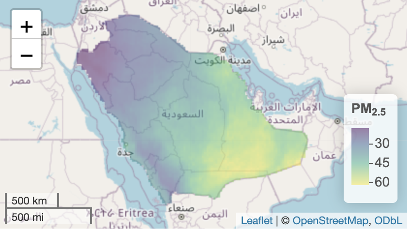

We often work with spatial disease data, where we know the number of cases in different regions or cities, such as lung cancer cases across various regions of Saudi Arabia. Identifying areas with the highest disease risk can provide valuable insights, such as:

- Uncovering underlying risk factors contributing to diseases in high-risk regions.
- Supporting early intervention and targeted prevention strategies.
- Allocating healthcare resources more effectively to areas in greatest need.

However, simply looking at the raw disease cases, as shown in **Figure 1**, can be misleading. Regions like Riyadh, the Eastern Province, and Makkah may show the highest case numbers, but that doesn't necessarily indicate higher risk—these regions have larger populations, which could naturally result in more cases. To avoid this bias, we use statistical models to estimate the **relative risk** of the disease.

When we look at the estimated relative risk in **Figure 2**, we get a clearer picture. For example, while Jazan didn’t appear as a hotspot based on the raw case counts, it emerges as a high-risk region in the relative risk map. This provides more accurate insights than just looking at case numbers.

To make it even easier, we can use **cluster maps** to highlight regions that exceed a specific risk threshold, such as a relative risk higher than 1.1. The cluster map gives a quick view of the most critical areas that require investigation and resource allocation.

For more accurate risk estimation—and ultimately better cluster identification—it’s essential to include risk factors in the model. For lung cancer, for example, including pollution levels like $\text{pm}_{2.5}$ as a risk factor can significantly improve our estimates. Our services in Sorat Alardh leverage satellite data for risk factors like pollution to enhance the accuracy of these disease risk models, helping decision-makers allocate resources more efficiently.


- To access our **Sorat Alardh** application for detecting disease clusters, click [here](https://skyspatial-281410227287.us-central1.run.app/).

- For uploading data to the application, you can download the data template [here](https://drive.google.com/file/d/1TLux8gClwGOoBHZAIZphwnpwXX55Hwfn/view?usp=drive_link). Simply fill in your data and upload it directly to the app.

- We would appreciate your feedback! Please take a moment to complete our survey [here](https://forms.gle/SWwahyDeYdcbB4as8).


```{r , echo=FALSE, message=FALSE, warning=FALSE}

# {width=500px}

library(readxl)
library(sf)
library(ggplot2)
library(rgeoboundaries)
library(rnaturalearth)
library(dplyr)
library(SpatialEpi)
library(spdep)
library(INLA)
library(sp)
library(Matrix)
library(spData)


##############################
# Get the map of Saudi Arabia
##############################

map <- ne_states(country = "Saudi Arabia", returnclass = "sf")
map$name[1]="Eastern Province"
map$name[2]="Northern Borders"
map$name[3]="Al Jawf"
map$name[4]="Najran"
map$name[5]="Asir"
map$name[6]="Jazan"
map$name[7]="Tabuk"
map$name[8]="Madinah"
map$name[9]="Makkah"
map$name[10]= "Riyadh"
map$name[11]="Qassim"
map$name[12]="Hail"
map$name[13]="Al Bahah"
map <- st_set_crs(map, 4326) #certain projection
map <- map[order(map$name),] #alphabetically ordered
#map<-map %>% select(name,geometry)

# class(map)
# map$name
##################
# Get the data
##################

data <- read.csv("data/fulldata.csv", header = T)
data <- data[order(data$name),]

#############################
# Merge the data and the map
#############################


map <- map %>%
  left_join(data, by = "name")


####################################
####################################
              # Diabtes
####################################
####################################

################### Expected ###############


map$E <- expected(
  population = map$population ,
  cases = map$Cancer, n.strata = 1
)


############## INLA ########################

nb <- poly2nb(map) #converts a spatial object (map) into a matrix (nb) to create a neighbors list based on areas with touching boundraies
nb2INLA("map.adj", nb) #converts the neighbor matrix (nb) to (map.adj) format suitable for INLA

g <- inla.read.graph(filename = "map.adj") # read it in INLA


#the BYM model includes two random effects: u and v
map$re_u <- 1:length(map$name) #call idareau the indices vector for u, set from 1...i
map$re_v <- 1:length(map$name) #call idareav the indices vector for u, set from 1...i


#specify the model formula: the response variable in the left hand-side and the fixed and random effects in the right-hand side
#for u we use the model besag~ CAR dist. and with neighborhood structure, for v we use the model iid (both variables are identical)
formula <- map$Cancer ~ 1 + f(re_u, model = "besag", graph = g, scale.model = TRUE) + f(re_v, model = "iid") #make the precision parameter of models with different CAR priors comparable


#we fit the model using INLA, assuming a Poisson family
res <- inla(formula, family = "poisson", data = map, E = map$E,
            
            control.predictor = list(compute = TRUE), #compute the posteriors of the predictions
            control.compute = list(return.marginals.predictor = TRUE), verbose = T)


## RR

map$RRC <- res$summary.fitted.values[, "mean"]


## ex

exc <- sapply(res$marginals.fitted.values,
              FUN = function(marg){1 - inla.pmarginal(q = 1.18, marginal = marg)})

map$exc <- exc


# Load necessary libraries
library(leaflet)
library(htmltools)

# Create labels for the Cancer map
labels_cancer <- sprintf("<strong>%s</strong><br/>Cancer Cases: %s", 
  map$name, map$Cancer) %>%
  lapply(htmltools::HTML)

# Create color palette for Cancer map
pal_cancer <- colorNumeric(palette = "viridis", domain = map$Cancer)

# First map - Cancer
map1 <- leaflet(map) %>%
  addTiles() %>%
  addPolygons(
    color = "grey", weight = 1, 
    fillColor = ~pal_cancer(Cancer), fillOpacity = 0.5,
    highlightOptions = highlightOptions(weight = 4),
    label = labels_cancer,
    labelOptions = labelOptions(style = list("font-weight" = "normal", padding = "3px 8px"),
                                textsize = "15px", direction = "auto")
  ) %>%
  addLegend(
    pal = pal_cancer, values = ~Cancer, opacity = 0.5, title = "Cases", position = "bottomright"
  )

# Create labels for the Relative Risk map
labels_rr <- sprintf("<strong>%s</strong><br/>Relative Risk: %s", 
  map$name, map$RRC) %>%
  lapply(htmltools::HTML)

# Create color palette for Relative Risk map
pal_rr <- colorNumeric(palette = "viridis", domain = map$RRC)

# Second map - Relative Risk
map2 <- leaflet(map) %>%
  addTiles() %>%
  addPolygons(
    color = "grey", weight = 1, 
    fillColor = ~pal_rr(RRC), fillOpacity = 0.5,
    highlightOptions = highlightOptions(weight = 4),
    label = labels_rr,
    labelOptions = labelOptions(style = list("font-weight" = "normal", padding = "3px 8px"),
                                textsize = "15px", direction = "auto")
  ) %>%
  addLegend(
    pal = pal_rr, values = ~RRC, opacity = 0.5, title = "RR", position = "bottomright"
  )

# Create labels for the Cluster map
labels_cluster <- sprintf("<strong>%s</strong><br/>Cluster Value: %s", 
  map$name, map$exc) %>%
  lapply(htmltools::HTML)

# Create color palette for Cluster map
pal_cluster <- colorNumeric(palette = "viridis", domain = map$exc)

# Third map - Cluster
map3 <- leaflet(map) %>%
  addTiles() %>%
  addPolygons(
    color = "grey", weight = 1, 
    fillColor = ~pal_cluster(exc), fillOpacity = 0.5,
    highlightOptions = highlightOptions(weight = 4),
    label = labels_cluster,
    labelOptions = labelOptions(style = list("font-weight" = "normal", padding = "3px 8px"),
                                textsize = "15px", direction = "auto")
  ) %>%
  addLegend(
    pal = pal_cluster, values = ~exc, opacity = 0.5, title = "Cluster", position = "bottomright"
  )

# Display all maps side by side
browsable(
  tagList(
    div(style = "display: flex; justify-content: space-between;",
        div(style = "width: 45%; height: 600px; padding-right: 20px;",  
            map1, HTML("<p style='text-align: center; font-size: 20px;'>Figure 1: Cases of cancer</p>")),
        div(style = "width: 45%; height: 600px; padding-left: 20px; padding-right: 20px;", 
            map2, HTML("<p style='text-align: center; font-size: 20px;'>Figure 2: Relative risk of cancer</p>")),
        div(style = "width: 45%; height: 600px; padding-left: 20px;", 
            map3, HTML("<p style='text-align: center; font-size: 20px;'>Figure 3: Cluster of cancer</p>"))
    )
  )
)


```


```{r echo=FALSE, message=FALSE, warning=FALSE, out.width="50%", fig.align='default', eval=FALSE}

library(leaflet)
library(htmltools)

# Create labels for the Relative Risk map (only show population and observed)
labels_rr <- sprintf("<strong>%s</strong><br/>Observed: %s <br/>Population: %s",
  map$name, map$Diabetes, map$population) %>%
  lapply(htmltools::HTML)

# Create color palette for Relative Risk map
pal_rr <- colorNumeric(palette = "viridis", domain = map$RRC)

# Create Relative Risk map
l_rr <- leaflet(map) %>% 
  addTiles() %>%
  addPolygons(color = "grey", weight = 1, fillColor = ~pal_rr(RRC), fillOpacity = 0.5,
              highlightOptions = highlightOptions(weight = 4),
              label = labels_rr,
              labelOptions = labelOptions(style = list("font-weight" = "normal", padding = "3px 8px"),
                                          textsize = "15px", direction = "auto")) %>%
  addLegend(pal = pal_rr, values = ~RRC, opacity = 0.5, title = "Relative Risk", position = "bottomright")

# Create labels for the Cluster map (only show population and observed)
labels_cluster <- sprintf("<strong>%s</strong><br/>Observed: %s <br/>Population: %s",
  map$name, map$Diabetes, map$population) %>%
  lapply(htmltools::HTML)

# Create color palette for Cluster map
pal_cluster <- colorNumeric(palette = "viridis", domain = map$exc)

# Create Cluster map
l_cluster <- leaflet(map) %>%
  addTiles() %>%
  addPolygons(color = "grey", weight = 1, fillColor = ~pal_cluster(exc), fillOpacity = 0.5,
              highlightOptions = highlightOptions(weight = 4),
              label = labels_cluster,
              labelOptions = labelOptions(style = list("font-weight" = "normal", padding = "3px 8px"),
                                          textsize = "15px", direction = "auto")) %>%
  addLegend(pal = pal_cluster, values = ~exc, opacity = 0.5, title = "Cluster", position = "bottomright")

# Display maps side by side using HTML layout
browsable(
  tagList(
    div(style = "display: inline-block; width: 48%;", l_rr),
    div(style = "display: inline-block; width: 48%;", l_cluster)
  )
)

# {width=6000px}
```


